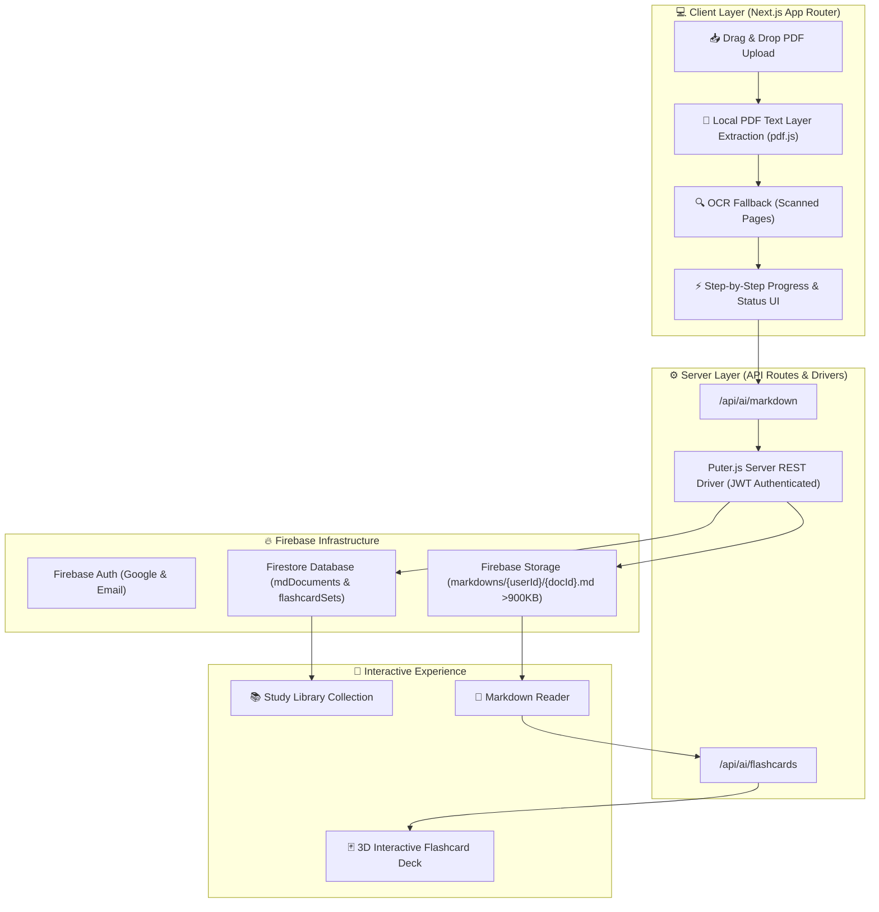

# 📚 AI Exam Teacher

> Turn any textbook PDF or scanned exam note into AI-synthesized Markdown study guides and interactive 3D flashcard decks.

---

## 🚀 Overview

**AI Exam Teacher** is a modern, agent-driven study platform designed to transform raw PDFs into structured Markdown documents and quizzable flashcards. 

- **Dual Extraction Pipeline**: Extracts native text layers using `pdf.js` with fallback OCR capabilities for scanned pages.
- **Server-Side AI Synthesis**: Processes raw page extractions into structured Markdown study guides using AI models.
- **Firebase Firestore & Storage Layer**: Securely persists study guides and flashcards with automatic storage overflow handling for documents >900KB.
- **Interactive 3D Flashcards**: Quizzable flip-card interface with model selection, free/paid AI options, and historical regeneration tracking.
- **5-Agent Autonomous Lifecycle**: Built and maintained by a 5-agent team (Backend, Frontend, Testing, Reviewer, Git) using GitHub Projects (v2).

---

## 🔄 Project Flow & Architecture Diagram



---

## 🤖 Autonomous Agent Team Workflow

The project maintains a strict 5-agent lifecycle managed via GitHub Project V2 Board:

```
Backlog ➔ Ready ➔ In Progress (Backend / Frontend) ➔ In Review ➔ Testing ➔ Done
```

| Agent Role | Primary Responsibilities | Scope & Hand-off |
|---|---|---|
| 🛠️ **Backend Agent** | Firestore schemas, Storage overflow (`>900KB`), Security Rules compliance, `lib/firebase/store.ts` service. | Implements backend storage logic and hands off to Frontend. |
| 🎨 **Frontend Agent** | `UploadPage`, `LibraryPage`, `DocumentPage`, `FlashcardsPage`, loading & retryable error states. | Builds UI components and hands off to Reviewer. |
| 🔍 **Reviewer Agent** | Code quality gate, security rules audit (`request.auth.uid == userId`), architectural consistency. | Approves code with `ready-for-testing`. |
| 🧪 **Testing Agent** | Vitest suite (`tests/firebase-store.test.ts`), `npm run typecheck`, `npm run lint`. | Comments `tests-pass` when all checks succeed. |
| 🐙 **Git Agent** | GitHub Board column movements, PR merges, automated issue creation, Git commits & pushes. | Merges code to `main` and closes ticket. |

---

## 🛠️ Technology Stack

- **Framework**: Next.js 16 (App Router), React 19, TypeScript
- **Styling**: Tailwind CSS v4, Vanilla CSS (Dark Glassmorphism design system)
- **Backend & Database**: Firebase Auth, Firestore Database, Firebase Storage
- **PDF & AI**: `pdf.js` (PDF parsing), Puter REST driver (server-side JWT AI integration)
- **Testing & Verification**: Vitest, ESLint 9, TypeScript (`tsc --noEmit`)

---

## ⚙️ Installation & Local Setup

### 1. Prerequisites
- Node.js `v20.x` or higher (tested on `v24.15.0`)
- npm `v10.x` or higher

### 2. Install Dependencies
```bash
npm install
```

### 3. Environment Configuration
Create `.env.local` in the root directory:

```env
# Firebase Client Configuration
NEXT_PUBLIC_FIREBASE_API_KEY=your_firebase_api_key
NEXT_PUBLIC_FIREBASE_AUTH_DOMAIN=your_project.firebaseapp.com
NEXT_PUBLIC_FIREBASE_PROJECT_ID=your_project_id
NEXT_PUBLIC_FIREBASE_STORAGE_BUCKET=your_project.appspot.com
NEXT_PUBLIC_FIREBASE_MESSAGING_SENDER_ID=your_sender_id
NEXT_PUBLIC_FIREBASE_APP_ID=your_app_id

# Puter.js Server Driver JWT
PUTER_API_KEY=your_puter_jwt_token

# GitHub API Integration (Optional for board scripts)
GITHUB_TOKEN=your_github_pat_token
```

### 4. Development & Testing Commands
```bash
# Start development server (http://localhost:3000)
npm run dev

# Run TypeScript type checker
npm run typecheck

# Run ESLint check
npm run lint

# Run Vitest unit test suite
npm run test

# Build production bundle
npm run build
```

---

## 📁 Repository Directory Structure

```
├── docs/                        # Complete architecture & backlog planning package
│   ├── 00-OVERVIEW.md           # Product data flow & system design
│   ├── 01-TECH-STACK.md         # Technology choices & rationale
│   ├── 02-DATA-MODEL.md         # Firestore collection schemas & overflow specs
│   ├── 03-AGENT-TEAM.md         # 5-Agent protocol & hand-off rubric
│   ├── 04-GITHUB-PROJECT-SETUP.md# GitHub board & label mapping
│   ├── 05-TICKET-BACKLOG.md     # Epics & ticket backlog list
│   └── tickets/                 # Execution ticket markdown records
├── src/
│   ├── app/                     # Next.js App Router (pages & API routes)
│   │   ├── api/ai/              # Server-side AI endpoint routes
│   │   ├── doc/[id]/            # Markdown reader & flashcards pages
│   │   ├── library/             # Study library page
│   │   └── upload/              # PDF upload & extraction pipeline page
│   └── lib/                     # Data stores & utilities
│       ├── firebase/            # Firebase config, types, and store service
│       ├── pdf/                 # PDF.js text layer extractor
│       └── puter/               # Puter.js driver wrappers
├── tests/                       # Vitest unit test suite
├── firestore.rules              # Security rules enforcing per-user auth scoping
└── package.json                 # Scripts & dependencies
```

---

## 🛡️ Security & Rule Compliance

- **Firestore Security Rules**: All read, write, and delete operations require `request.auth != null && request.auth.uid == request.resource.data.userId`. Unauthenticated/anonymous writes are strictly blocked.
- **Storage Scoping**: User documents >900KB are securely uploaded to Firebase Storage under `users/{userId}/mdDocuments/{docId}.md`.
- **Environment Isolation**: API tokens and JWT credentials are stored strictly in environment variables and never committed to source control.
